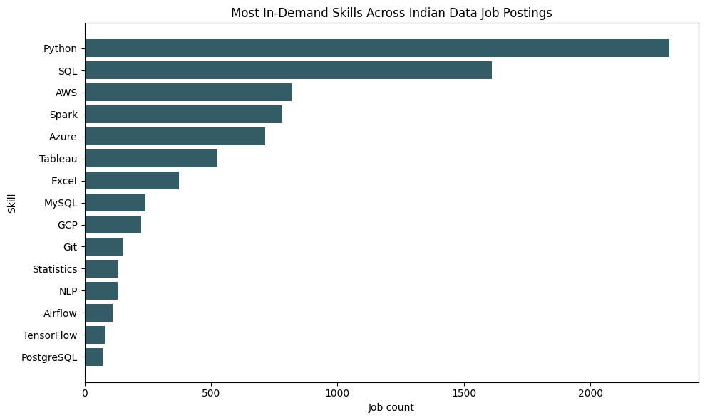
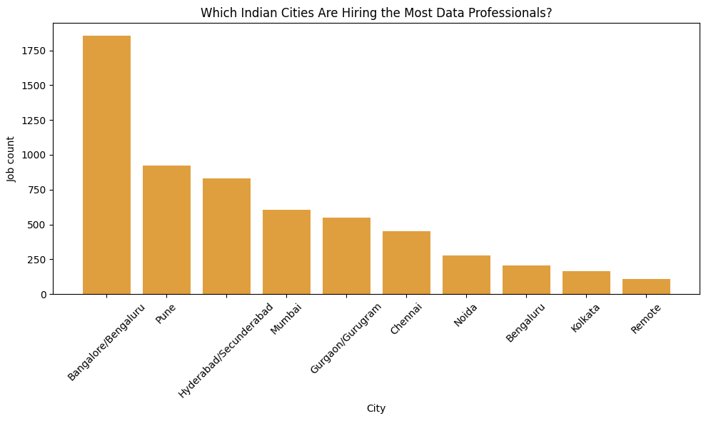

# India Data Jobs Pulse: Skills & Hiring Demand Analysis (2026)

> Analysing 12,000+ Naukri job postings to decode what Indian data roles actually demand, and where they're hiring.

---

## Key Findings

| # | Finding |
|---|---------|
| 🐍 | **Python leads at 33.3%** of data role postings, ahead of SQL at 23.1%  reversing the traditional analyst stack priority |
| ☁️ | **Cloud skills are no longer optional** AWS + Azure + GCP combined appear in ~25% of postings, rivalling SQL |
| 📍 | **Bengaluru accounts for 26.7%** of all data role demand; Pune and Hyderabad are the next strongest hubs |
| 🔍 | **Data Engineer (580 postings) outpaces Data Analyst (353)** the Indian market values infrastructure builders over insight generators |
| 🎯 | **Git appears in only 151 postings** among top-10 skills the most underrated skill relative to its real-world importance |

---

## Dashboard

🔗 **[View Live Looker Studio Dashboard](#)** ← *(replace with your dashboard link)*




---

## Project Structure

```
india-data-jobs-pulse/
├── india_data_jobs_pulse.ipynb   # Main analysis notebook
├── exports/
│   ├── top_skills.csv            # Skill demand summary (25 skills)
│   ├── city_demand.csv           # Job count by city
│   ├── role_demand.csv           # Job count by role title
│   └── summary.csv               # Dashboard KPI scorecard
│   ├── top_skills.png            # Horizontal bar chart
│   └── city_demand.png           # City demand bar chart
└── README.md
```

---

## Notebook Sections

| Section | What it does |
|---------|-------------|
| 0 — Setup | Installs libraries, mounts Google Drive, creates folder structure |
| 1 — Raw Data | Downloads dataset via Kaggle API, inspects shape and nulls |
| 2 — Cleaning | Standardises column names, removes duplicates, auto-detects key columns |
| 3 — Role Filter | Filters 12,000 rows to 6,952 data role postings (57% of dataset) |
| 4 — Skill Extraction | Regex-based extraction of 25 curated skills across all text columns |
| 5 — City Demand | City-level hiring count + city × skill cross-analysis |
| 6 — Role Demand | Top 20 role titles by posting count |
| 7 — Key Findings | 5 formatted data-driven insight statements |
| 8 — Visualisations | Two matplotlib charts saved as PNG |
| 9 — Summary Table | 4-row KPI table for dashboard scorecards |
| 10 — Export | Pushes all tables to Google Sheets via gspread API |
| 11 — Save CSVs | Saves all processed tables locally to Google Drive |

---

## Tech Stack

| Tool | Purpose |
|------|---------|
| Python 3 | Core analysis language |
| pandas | Data cleaning and aggregation |
| re (regex) | Word-boundary skill extraction |
| matplotlib | Chart generation |
| gspread | Google Sheets API export |
| Google Colab | Notebook environment |
| Google Sheets | Dashboard data source |
| Looker Studio | Interactive BI dashboard |

---

## Dataset

- **Source:** [12,000 Data Science Jobs in India — Naukri.com](https://www.kaggle.com/datasets/anandhuh/data-science-jobs-in-india) via Kaggle
- **Size:** 12,000 rows × 5 columns
- **Columns:** Job Role, Company, Location, Job Experience, Skills/Description
- **License:** DBCL 1.0
- **Note:** `kaggle.json` is not included in this repo. Generate your own at kaggle.com → Settings → API Tokens.

---

## How to Run

1. Open `india_data_jobs_pulse.ipynb` in [Google Colab](https://colab.research.google.com)
2. Go to **Runtime → Run all** — or run cells section by section (recommended)
3. When Cell 2 prompts for `kaggle.json`, upload your Kaggle API token
4. After Section 10 completes, copy the printed Google Sheets URL
5. Connect the Sheets URL to Looker Studio to build the dashboard

---

## Skills Extracted

`SQL` `Python` `Excel` `Tableau` `Power BI` `Looker` `BigQuery` `Spark` `dbt` `Airflow` `Git` `Pandas` `NumPy` `Scikit-learn` `TensorFlow` `AWS` `Azure` `GCP` `Statistics` `NLP` `Power Query` `Looker Studio` `MySQL` `PostgreSQL` `Alteryx`

---

## Author

**Onkar Dhingra** — Data Analyst  
[LinkedIn](https://linkedin.com/in/onkar-dhingra) · [GitHub](https://github.com/Onkar2087) · onkardhingra99@gmail.com
